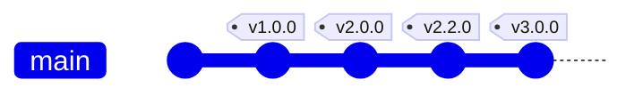
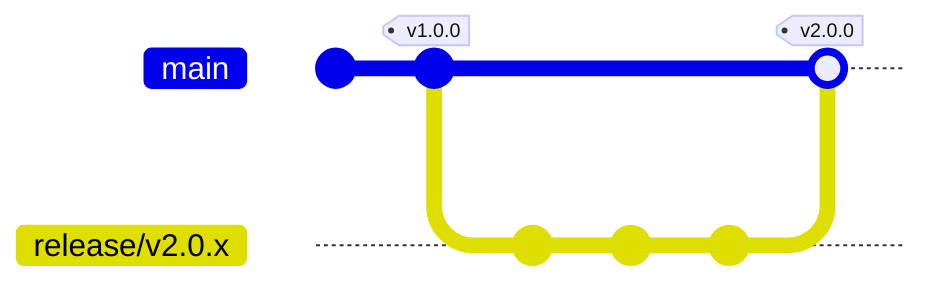
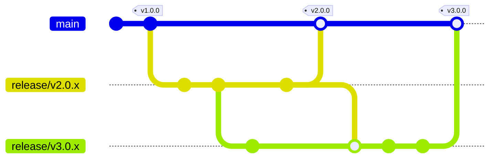
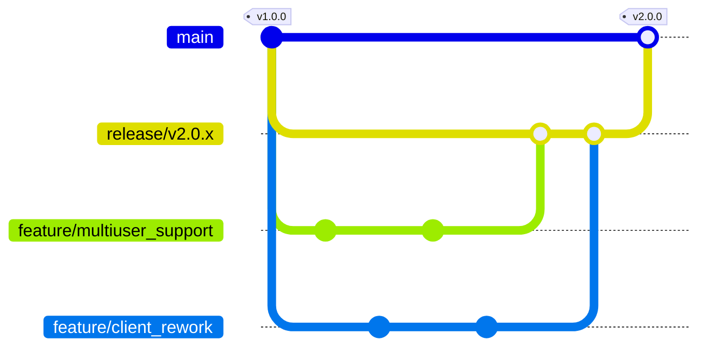
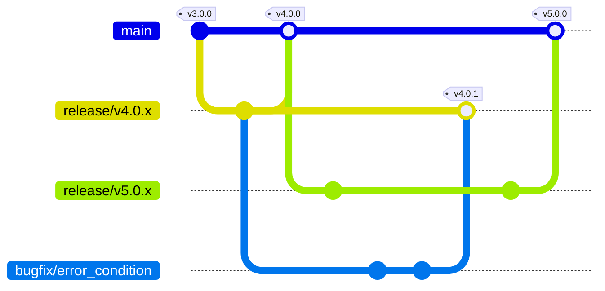

## Branches

### Main branch

The main branch (or default branch) is the singular branch existing on a new repository.
As it is the branch that is represented as the projects current state by default, it is of the utmost importance to keep the software on the main branch in a stable state. Therefore direct work on the main branch is forbidden. Instead the branch is used to track the latest release version of the project.
Releases on the main branch are tagged to allow a traceable overview of software releases.

:warning: Merging to the main brach has to be done via pull request with accepted review. :warning:

### Release branches

A release branch has the prefix `release/`. Big surprise here. The full branch name consists of the prefix and the **future** release version that will be published to main when the work on all features has been completed `release/<version>`.

While the state of the software on a release branch does not necessarily have to be stable, they serve as a staging area for the integration of new features and fixes. This in turn also means they are not intended to be worked on directly.

In an ideal world, the work on release v3.0.0 can begin after release v2.0.0 is completed and the new tag can be used as a branching point for the next release branch. In practice, shifting priorities and complexities will result in the need for parallel release branches as shown below.

:warning: Merging to a release brach has to be done via pull request with accepted review. :warning:

To track fixes on an already released tag, the release branch can be kept in use. See the [bugfix brach section below](#bugfix-branches).

### Feature branches

Feature branches are created to implement or change a distinct feature. There are no special restrictions on feature branches and work can be directly commited to a feature branch.

Feature branch naming convention is a prefix plus the name of the feature to be worked on, like `feature/multiuser_support` or `feature/client_rework`.

### Bugfix branches

Bugfix branches are indicated by the `bugfix/<name>` naming sheme. They are used to solve identified issues in already existing releases.
To make these fixes available for already published releases, a special release branch can be created. For example branch `release/v4.0.x` would serve as the way to release bugfix versions of release v4.0.0.
This allows for a cleaner main branch and the possibility to resolve issues in old releases without affecting the work for future software versions.

