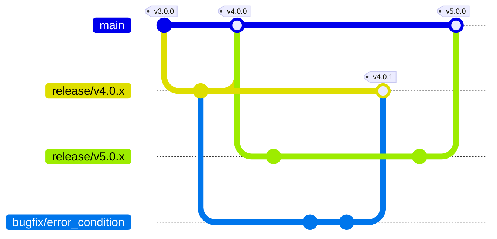

```mermaid
%%{init: { 'gitGraph': {'showCommitLabel': false}} }%%
gitGraph
    commit tag: "v3.0.0"
    branch release/v4.0.x
    commit
    checkout main
    merge release/v4.0.x tag: "v4.0.0"
    branch release/v5.0.x
    commit
    checkout main
    checkout release/v4.0.x
    branch bugfix/error_condition
    commit
    commit
    checkout release/v4.0.x
    merge bugfix/error_condition tag: "v4.0.1"
    checkout release/v5.0.x
    commit
    checkout main
    merge release/v5.0.x tag: "v5.0.0"
```