# NewTec GIT branching guidelines

    NOTE: This whole documentation is a draft and work in progress. It does not represent the current guidelines of the company.

## Introduction

Git is purely a tool and leaves the users with many options to structure and work with their repositories. Over the years different strategies have emerged to allow efficient cooperative work and a traceable lifecycle for software projects managed with git. Depending on project complexity and team size, different rulesets ensure either light overhead and flexibility or a tight harness for each developer.

But while each set or rules or guidelines has their pros and cons, a different aspect has proven most important for successful and smooth work in a shared repository. That each member of the project operates on the same base of rules and structures.

This page is therefore intended to introduce the overall branching strategy to be used in future projects. It will serve as a starting point for new project members to get up to speed with the existing workflow and a reference manual for developers.

## Content

Below is a visualization of an example workflow in a project. More information can be found on the following pages:

- For details on the different types of branches visit the [branch types](branch_types.md) page.
- Information on [Pull Requests](pull_request.md) and where they are mandatory to use.
- A small introduction on the [Continuous Integration](ci.md) deployed in the projects.

