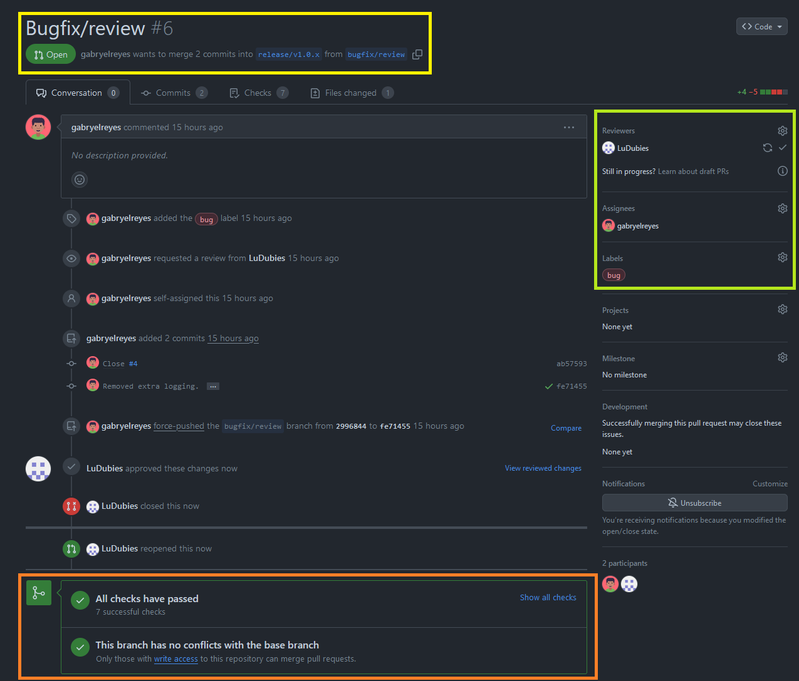

# Pull Requests

Some aspects of the Pull Request interface are highlighted on this page.

## Introduction

A Pull Request is a useful mechanism to integrate changes and new additions into the existing code. Instead of just merging changes made in a feature or bugfix branch into a release branch, the Pull Request allows the creator of the changes to present all of their work to their collaborators. This enables those collaborators to efficiently review these changes before they are added to the more stable branches.
You can find information on where Pull REquests are mandatory on the [branches page](branch_types.md).

## Overview

Show above is the UI for an example Pull Request.
In the yellow box at the top, the source and target branch of the pull request are shown.
Below that, all the user actions are detailed chronologically.

In the right column, highlighted in green, the creator of the pull request and all invited reviewers and their approval status are shown.
On the bottom of the page, the proposed changes are automatically checked for potential conflicts.

The "Files changed" tab allows for a detailed view of the changes, allowing reviewers and creator to exchange comments and requests.

If enough approved reviews are conducted, a collaborator with write access to the target branch can merge the Pull Request.