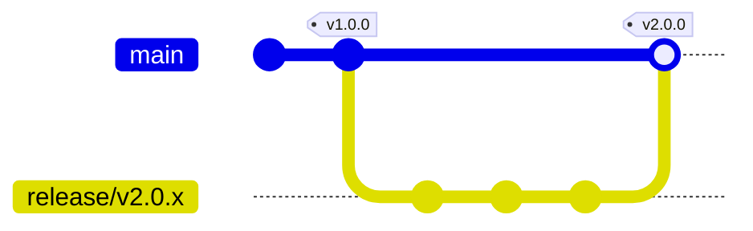
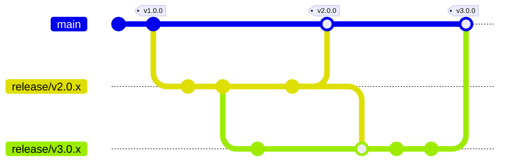

```mermaid
%%{init: { 'gitGraph': {'showCommitLabel': false}} }%%
gitGraph
   commit
   commit tag: "v1.0.0"
   branch release/v2.0.x
   commit
   commit
   commit
   checkout main
   merge release/v2.0.x tag: "v2.0.0"

```

```mermaid
%%{init: { 'gitGraph': {'showCommitLabel': false}} }%%
gitGraph
   commit
   commit tag: "v1.0.0"
   branch release/v2.0.x
   commit
   commit
   branch release/v3.0.x
   commit
   checkout release/v2.0.x
   commit
   checkout main
   merge release/v2.0.x tag: "v2.0.0"
   checkout release/v3.0.x
   merge release/v2.0.x
   commit
   commit
   checkout main
   merge release/v3.0.x tag: "v3.0.0"

```